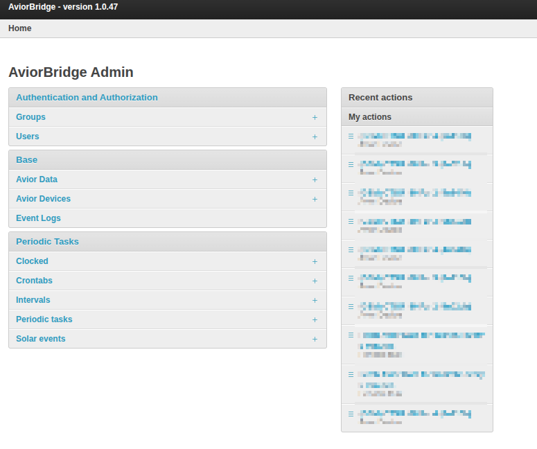
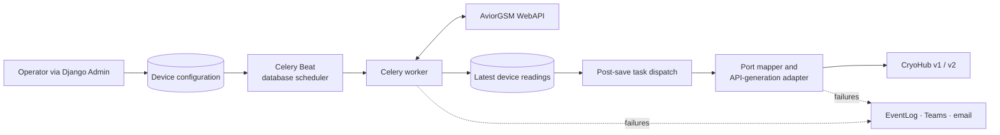

  

<h1 align="center">AviorBridge</h1>

  <b>An integration service I built solo that connects AviorGSM loggers to CryoHub —
  polling devices, translating their data and forwarding fresh readings without manual imports.</b>

  <a href="#product">Product</a> ·
  <a href="#architecture">Architecture</a> ·
  <a href="#engineering">Engineering</a> ·
  <a href="#quality">Quality</a>

 

AviorGSM loggers and CryoHub expose different data models and APIs. I built AviorBridge to close that gap: it polls registered devices, detects fresh readings, maps physical ports to CryoHub channels and forwards the result without requiring operators to run manual imports.

**My role: Sole engineer · end-to-end design, implementation, deployment and maintenance**

I designed the integration boundary, data model, asynchronous workflow and operator tooling. I also built the deployment configuration, health checks, failure reporting, test suite and user documentation that keep the service supportable in production.

|  Automated acquisition |  Flexible routing |  API translation |  Operational visibility |
| :--- | :--- | :--- | :--- |
| Each configured device receives its own database-backed polling schedule. | Operators choose the target environment per device without changing application code. | JSON port mappings translate heterogeneous logger layouts into CryoHub channels. | Persistent event logs, task health checks, Flower, email and Teams alerts shorten diagnosis. |

<!--
HERO SCREENSHOT — Device operations

Capture the Django Admin device list with anonymised records, active status, target server, latest log ID and device-layout links visible. The image should show that a small operations team can manage the complete fleet from one place.
-->

##  Product

AviorBridge turns device onboarding into an operational workflow rather than a development task. An operator registers a logger, supplies its CryoHub destination and selects a port mapping; the service creates the schedule and begins processing new readings in the background.

|  Configure once |  Run continuously |
| :--- | :--- |
| Each device is registered with its WebID, target server and port mapping. Device-specific routing and transformation are configuration, not source-code changes. | Every device gets its own Celery Beat entry with a visible interval and latest run time, so schedules can be inspected and adjusted by an operator. |
| ** Diagnose with context** | ** Observe background work** |
| Integration failures are stored as filterable event-log records that retain the device and stack-trace context. | Flower shows worker availability and recent AviorBridge tasks, so asynchronous processing is visible without shell access. |

##  Architecture

The system sits between the AviorGSM WebAPI and two generations of the CryoHub ingestion API. The defining constraint is variability: each physical logger can expose a different port layout while its destination expects a stable channel schema and ordered log identifiers. AviorBridge isolates that variability in per-device configuration and keeps network work off the request path.

**Django 5.2 LTS · Django REST Framework · Celery 5.6 · RabbitMQ / Redis · PostgreSQL / SQLite**

##  Engineering

<strong>Make device onboarding data-driven</strong>

 

The service needs to support multiple independently scheduled loggers without creating deployment work for every installation. I modelled device identity, credentials, target environment and channel mapping as operator-managed data. A Django `post_save` signal creates or updates a named `django-celery-beat` task when a device has the credentials required for polling.

| Challenge | Decision | Result |
| :--- | :--- | :--- |
| Every logger needs an independent polling cycle. | Store schedules in Django's database-backed Celery Beat scheduler. | Tasks are inspectable and adjustable through the same admin surface as devices. |
| Device layouts differ between installations. | Store source-key, value-key and destination-channel mappings as JSON per device. | New layouts can be supported without branching the forwarding code. |
| Operators need safe defaults. | Provide admin actions for analogue-only and combined digital/analogue mappings. | Common configurations are applied consistently while custom mappings remain possible. |

<strong>Forward only fresh, correctly shaped telemetry</strong>

 

**Suppress unchanged samples.** Each poll compares both the main and battery runtimes with the latest stored payload. If neither has advanced, processing stops before creating another downstream write.

**Decouple acquisition from delivery.** Saving a fresh `AviorData` record queues a separate forwarding task only after the device has a complete CryoHub configuration. A slow destination therefore does not block the polling scheduler.

**Adapt at the boundary.** The forwarding layer resolves the selected server to CryoHub generation 1 or 2, requests the current remote log ID, builds one payload per mapped channel and adds a device timestamp for generation 2. The domain model stays stable while endpoint and payload differences remain in one adapter.

<strong>Design production failures to be diagnosable</strong>

 

The Celery application uses a durable queue, rejects tasks when a worker is lost and defines bounded retry settings. Integration exceptions can be persisted as device-linked `EventLog` records with truncated stack traces; critical database failures additionally fan out to Teams and superuser email, while incorrect Avior credentials raise a targeted Teams alert.

An independent health-check script inspects every database-backed periodic task. If a non-excluded task has never run or is more than an hour behind, it reports the task name, last-run time and server address to the operations channel. Flower provides a complementary live view of workers and queued tasks.

##  Quality

- **Testing:** 23 Django tests verified passing, with 73% measured statement coverage; the device models and API serializers each have 100% coverage. Tests exercise model constraints, mapping helpers, server-generation selection, data replacement and unknown-device validation.
- **Delivery:** GitHub Actions increments the build number on pushes to `main`; separate settings provide PostgreSQL/RabbitMQ production and SQLite/Redis development environments.
- **Reliability:** Runtime-based deduplication, asynchronous delivery, worker-loss rejection, persistent diagnostic records and an out-of-band periodic-task health check protect the acquisition pipeline.
- **Security:** Production enforces HTTPS redirects and secure session/CSRF cookies. Django authentication, CSRF and clickjacking middleware, password validators, CSP and masked admin password inputs protect the operator surface.
- **Developer experience:** Make targets start each local dependency and service, run coverage and expose a repeatable setup. A maintained 25-page user guide covers installation and operation.

<!--
Screenshot preparation

Use authentic screens with anonymised demonstration data. Keep one theme, consistent viewport sizes and legible text. Crop irrelevant browser chrome, but retain navigation and status context that explains each workflow.

| Planned asset | Capture brief |
| :--- | :--- |
| `static/aviorbridge/aviorbridge-banner.png` | A wide composition connecting an AviorGSM logger, AviorBridge and CryoHub; approximately 1600 × 600, without embedded body text. |
| `static/aviorbridge/device-operations.png` | The strongest admin device-list view with status, target and last-log context; approximately 1440 × 900. |
| `static/aviorbridge/device-configuration.png` | An anonymised device detail view showing routing and port-mapping configuration. Prove that device-specific routing and transformation are configuration, not source-code changes. |
| `static/aviorbridge/periodic-tasks.png` | Generated schedules with task names, intervals and recent execution times. Prove that each device is scheduled independently. |
| `static/aviorbridge/event-log.png` | A filtered operational event list and one diagnostic detail view. Prove that integration failures retain device and stack-trace context. |
| `static/aviorbridge/flower-monitoring.png` | Flower's worker/task view showing recent AviorBridge tasks. Prove that asynchronous processing is visible without shell access. |

User guide link (add once the PDF is in this repo): [User guide](Documentation/AviorBridge%20-%20Guide.pdf)
-->

 

  <a href="https://quantum-support.online/">Live instance</a> ·
  <a href="https://github.com/quantum-production-limited/AviorBridge">Source</a>

  
    Curious how the per-device scheduling, the port mapping or the CryoHub v1/v2 adapter
    actually work under the hood? That's exactly what I'd love to walk you through.
  

  <a href="README.md">← Back to all projects</a>

