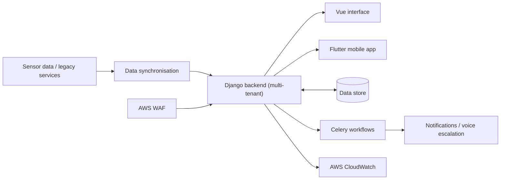
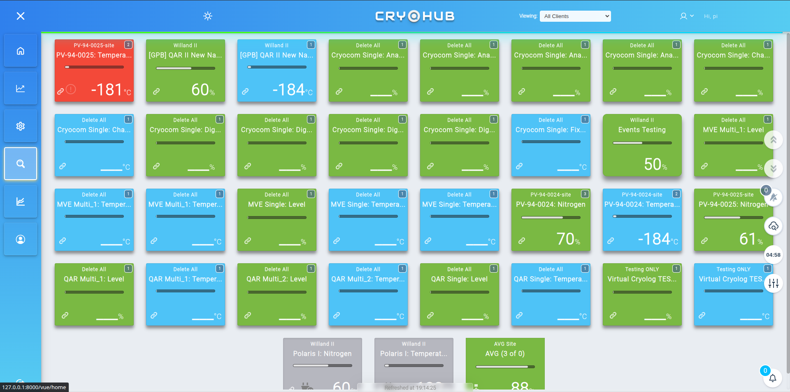
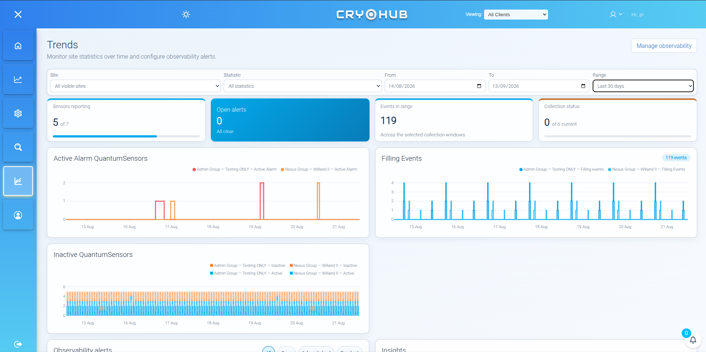
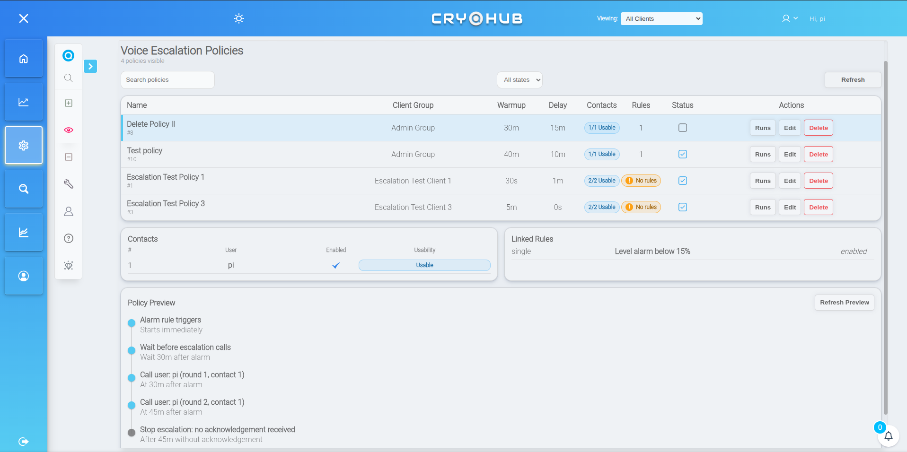
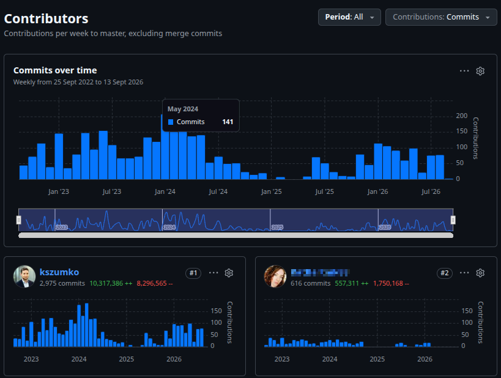

  

<h1 align="center">CryoHub Cloud</h1>

  <b>A multi-tenant cryogenics platform I architected and own end-to-end —
  turning unglamorous sensor data into a real-time monitoring and escalation product.</b>

  <a href="#highlights">Highlights</a> ·
  <a href="#the-bets-that-made-this-possible">Key decisions</a> ·
  <a href="#decisions-beyond-the-code">Beyond the code</a> ·
  <a href="#the-problem">The problem</a> ·
  <a href="#the-solution">The solution</a> ·
  <a href="#engineering-highlights">Engineering</a> ·
  <a href="#visuals">Visuals</a>

 

## Highlights

- **Principal architect and full owner of the backend and cloud infrastructure** for a multi-tenant SaaS platform (gen-2 of the CryoHub product line) — live, self-service, and serving multiple customers on shared infrastructure.
- **Designed the multi-tenant data model from the ground up**: customers are issued their own keys and self-govern sites, sensors, users and escalation policies, fully isolated from every other tenant on the same infrastructure.
- **Built a real-time alarm and escalation pipeline** that pages the right person, in the right order, until someone actually acknowledges the problem — not just a fire-and-forget notification.
- **Made a deliberate two-cloud infrastructure bet**: AWS for flexibility and managed database operations, IONOS for order-of-magnitude cheaper raw compute where it's the bulk of the always-on workload.
- **Diagnosed and fixed a production scaling failure** in the escalation scheduler by redesigning it around periodic sweeps instead of per-event Celery scheduling.
- **Co-designed and split the frontend 50/50** with a junior engineer I mentored — I drove architecture and layout, they built out components.
- **Contracted the API surface for a companion Flutter mobile app**, built independently by another senior engineer against the same Django backend.
- **Migrated legacy CryoHub installations into the platform**, syncing historical sensor and event data so existing customers never lose history.
- **#1 contributor by a wide margin** — 2,975 commits and the majority of the codebase's history, reflecting sole ownership of the architecture and backend.

 

## The Bets That Made This Possible

### Infrastructure: splitting AWS and IONOS instead of picking one cloud

> The easy path was to run everything on a single cloud provider and accept whatever that provider charges for always-on compute. I didn't take it.
>
> CryoHub Cloud's workload has two very different shapes: bursty, managed operations (the database, WAF, monitoring) that benefit from AWS's flexibility, and a constant, always-on processing load — sensor ingestion, Celery workers, sync jobs — where AWS's egress/ingress pricing would otherwise dominate the bill. I split the infrastructure deliberately: **AWS** for the pieces that need its flexibility and managed services, **IONOS** for raw compute running the always-on workers, where it's dramatically cheaper per unit of throughput.
>
> The trade-off is real: two providers means two operational surfaces to monitor, secure and reason about. I took that complexity on knowingly, because at this workload profile the cost delta was large enough to matter — not a theoretical saving.

### Escalation scheduling: periodic sweeps over per-event Celery tasks

> The first version of the escalation engine scheduled a Celery task per event — intuitive, and wrong at scale. Under real production load, it clogged the task queue: escalation timing is what pages someone when a cryogenic vessel is failing, so a backed-up queue isn't a performance nuisance, it's a reliability risk to the thing the whole feature exists to protect.
>
> I redesigned it around **periodic sweep-based scheduling**: a recurring check evaluates what's due, rather than a task being scheduled per alarm event. Queue pressure now scales with data volume instead of event count, and it hasn't reappeared as a failure mode since.

 

## Decisions Beyond the Code

Running a shared platform for multiple paying customers means the decisions outside the code matter as much as the ones inside it.

- **Distinct delivery paths for distinct jobs.** Push and in-app notifications go through **Novu**; voice escalation goes through **Amazon Connect**. I deliberately kept these separate rather than forcing one interchangeable notification mechanism to do both jobs badly.
- **Voice escalation is opt-in, not automatic.** It requires an active linked policy and account-level enablement per alarm rule — a hardware-originated alarm can't accidentally trigger a phone call to someone who never asked for one.
- **Security posture sized for a multi-tenant platform, not a single trusted tool.** AWS WAF and IP/network whitelisting sit in front of the application, AWS CloudWatch covers infrastructure monitoring and alerting, and `django-axes` enforces login-attempt throttling and lockouts.
- **Mentorship built into the delivery model.** The frontend was split 50/50 with a junior engineer by design — I owned architecture and layout decisions, they owned component implementation, deliberately structured as a growth opportunity rather than just a staffing split.
- **Contracted, not built in-house.** The Flutter mobile app was commissioned from another senior engineer against an API surface I defined — the right call for a platform that needed a native mobile client without pulling backend focus away from the core platform.

 

## The Problem

Cryogenic monitoring data is inherently unglamorous, and a missed alarm on a shared platform doesn't just mean one bad screen — it means one customer's storage failure looks like everyone's problem.

<table width="100%">
  <tr>
    <td width="33%" valign="top" align="center">
      <h3>🏢 Tenants Must Stay Isolated</h3>
      
Every customer's sites, sensors, users and policies live on shared infrastructure but must never leak into another tenant's view — self-service can't mean self-exposure.

    </td>
    <td width="33%" valign="top" align="center">
      <h3>🔔 Alarms Can't Go Quiet</h3>
      
An alarm has to become an ordered, trackable response — contact after contact, in order, until someone acknowledges it — not a single ping that's easy to miss.

    </td>
    <td width="33%" valign="top" align="center">
      <h3>📈 Dense Data Must Stay Readable</h3>
      
Tank levels, sensor drift, and temperature logs across dozens of sites are effortless to make ugly and unreadable if the visual layer is treated as an afterthought.

    </td>
  </tr>
</table>

 

## The Solution

CryoHub Cloud ingests sensor and legacy data centrally, applies tenant-scoped domain logic in Django, and serves the same API surface to both a Vue web app and a Flutter mobile app — with alarm handling and cloud sync running as independent background workflows.

1. **Ingest** — sensor telemetry and legacy events are synchronised into a single, tenant-scoped data model.
2. **Serve** — Django exposes one API contract to both the Vue SPA and the Flutter mobile app, so presentation stays decoupled from domain logic.
3. **Watch** — Celery workflows evaluate alarm conditions on a periodic sweep, not per-event, so the pipeline scales with data volume.
4. **Escalate** — a triggered alarm snapshots its policy at that instant and works through contacts in order, via push or voice, until someone acknowledges it.
5. **Report** — customers turn history into shareable PDF and CSV reports, access-checked server-side against their own tenant and sites.

 

## Engineering Highlights

The interesting problems here weren't "add another customer" — they were the guarantees that have to hold when a platform serves multiple paying customers on the same infrastructure.

**Escalation that preserves its instructions.** Each escalation run snapshots its policy at trigger time — contact order, timing and opt-out state. A later edit to that policy only applies to future runs, so an in-flight escalation can never be silently rewritten mid-response.

**Explicit alarm participation.** Voice escalation is opt-in per alarm rule, requiring an active linked policy and account-level enablement — hardware-originated alarms don't fall into a voice-call workflow by accident. Run tracking and acknowledgement make the full response lifecycle visible to operators.

**Multi-tenant reports with real access checks.** Advanced-report access follows the sensor's site and owning tenant/group, checked server-side before generation — not just hidden in the UI. Report generation combines charts, statistics and structured PDF navigation; CSV export offers a simpler, separate route to the raw data.

**Legacy integration as ongoing work, not a one-time migration.** Scheduled synchronisation keeps sensor information current and imports legacy events, so existing customers bring their history with them. Periodic-task registration and retirement is handled by an auto-discovery management command — each app declares its own task config, and the command finds and registers it, instead of a hand-maintained list that silently drifts out of date.

**Cloud sync that never risks alarm delivery.** Report generation, exports and legacy sync are fully decoupled from the alarm and escalation path, so heavier background work never competes with — or delays — the thing that pages someone.

 

## Architecture

<table>
<tr><th>Component</th><th>Stack</th><th>Role</th></tr>
<tr>
  <td><b>Backend</b></td>
  <td></td>
  <td>Python, Django REST Framework and Ninja APIs — multi-tenant domain logic, consumed by both web and mobile clients.</td>
</tr>
<tr>
  <td><b>Frontend</b></td>
  <td></td>
  <td>Vue 3 SPA with Pinia for state and ApexCharts/ECharts for visualisation — dense cryogenics data treated as a first-class design problem.</td>
</tr>
<tr>
  <td><b>Mobile</b></td>
  <td></td>
  <td>Companion Flutter app, built by a contracted engineer against an API surface I defined.</td>
</tr>
<tr>
  <td><b>Background work</b></td>
  <td></td>
  <td>Celery with periodic sweep-based scheduling — sensor sync, report generation and escalation runs.</td>
</tr>
<tr>
  <td><b>Cloud infrastructure</b></td>
  <td></td>
  <td>AWS for managed database operations, WAF and CloudWatch; IONOS for cheap always-on raw compute — a deliberate two-provider split.</td>
</tr>
<tr>
  <td><b>Notifications</b></td>
  <td>🔔 ☎️</td>
  <td>Novu for push/in-app notifications; Amazon Connect for voice escalation — distinct paths chosen for what each is best at.</td>
</tr>
<tr>
  <td><b>Security &amp; compliance</b></td>
  <td>🔒</td>
  <td>AWS WAF, IP/network whitelisting and <code>django-axes</code> login throttling — sized for a shared, multi-tenant platform.</td>
</tr>
</table>

 

## Visuals

<table width="100%">
<tr>
  <th>Sensor Observatory</th>
  <th>Trends &amp; Alerts</th>
  <th>Voice Escalation Policies</th>
</tr>
<tr>
  <td></td>
  <td></td>
  <td></td>
</tr>
<tr>
  <td>Every sensor, across every visible site, colour-coded by status at a glance.</td>
  <td>Historical trends, active alarms and observability alerts over a configurable range.</td>
  <td>Contact order, warmup and delay configured and previewed before an alarm ever escalates.</td>
</tr>
</table>

 

## Built to Last

- Over **80% Python test coverage**, covering escalation behaviour, APIs, advanced reports and CSV export.
- Over **90% Vue.js test coverage** (Jest + Vue Test Utils), plus Playwright end-to-end coverage that exercises the app the way an operator actually would.
- **GitHub Actions CI** runs backend and frontend suites on every push and pull request, substituting an in-memory database, broker and channel layer for fast, isolated runs.
- The whole backend is standardised on **`uv`** and **Ruff**, with a `Makefile` that takes a fresh checkout to a running environment in one command — onboarding speed treated as a deliberate investment, not an afterthought.

 

  
    Curious how the tenant isolation, the escalation snapshotting, or the AWS/IONOS
    split actually work under the hood? That's exactly what I'd love to walk you through.
  

  

