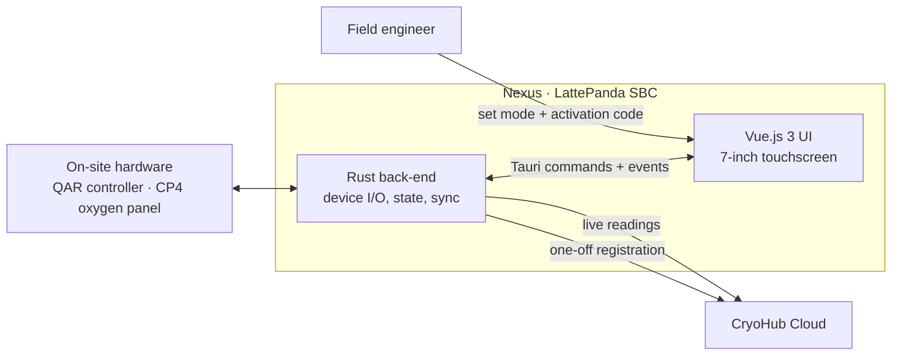
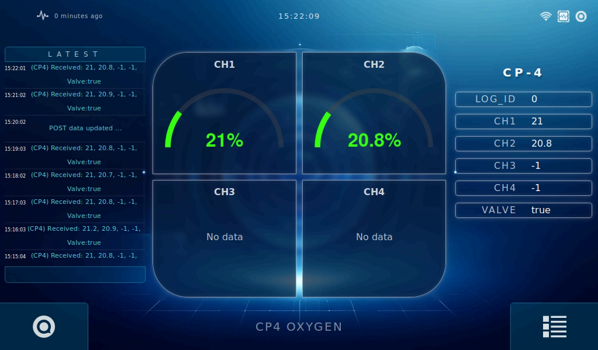
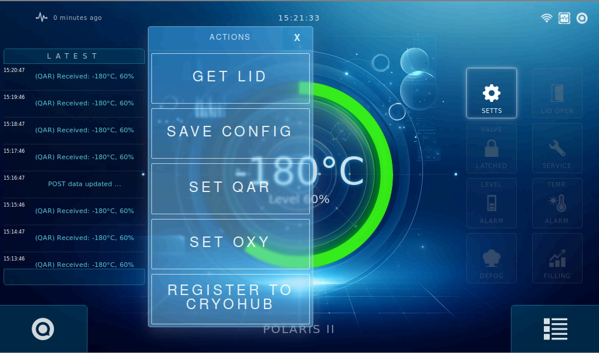
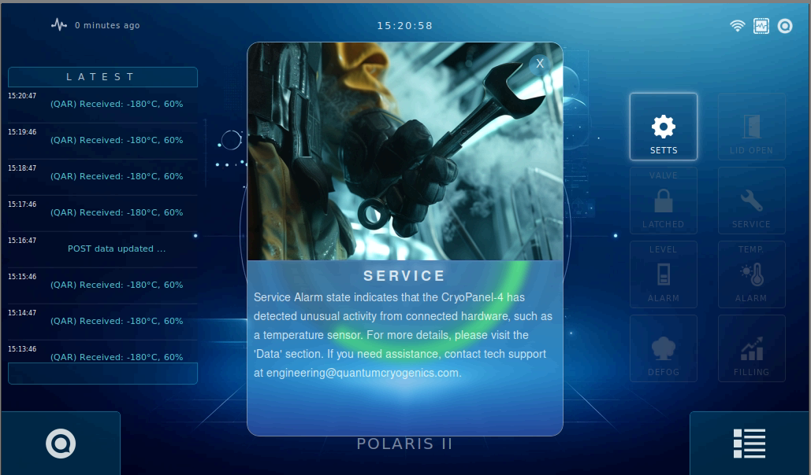

  

<h1 align="center">Nexus</h1>

  <b>A black-box edge device for cryogenic equipment — a Rust-powered Tauri app on a LattePanda SBC that an engineer connects to on-site hardware, links to CryoHub with a one-off activation code, and leaves running.</b>

  <a href="#the-problem">The Problem</a> ·
  <a href="#the-solution">The Solution</a> ·
  <a href="#tech-stack">Tech Stack</a> ·
  <a href="#visuals">Visuals</a> ·
  <a href="#design">Design</a>

 

<h2 align="center"> The Problem</h2>

Cryogenic storage sites run a mix of equipment — dewar controllers, oxygen monitors, valves — that was never designed to talk to the cloud. Bringing each one into CryoHub needs something physical on-site that is cheap, reliable, and simple enough for a field engineer to install without a developer on the phone.

<table width="100%">
  <tr>
    <td width="33%" valign="top">
      <h3 align="center"> Mixed hardware</h3>
      
Every site pairs different devices, from single temperature-and-level controllers to four-channel oxygen panels with valve state.

    </td>
    <td width="33%" valign="top">
      <h3 align="center"> Painful onboarding</h3>
      
Typing server addresses and credentials on a small screen in a cold room is slow and error-prone.

    </td>
    <td width="33%" valign="top">
      <h3 align="center"> Limited hardware</h3>
      
A compact single-board computer has to stay responsive around the clock, with no room for a heavy runtime.

    </td>
  </tr>
</table>

 

<h2 align="center"> The Solution</h2>

Nexus is a self-contained **black box**: a LattePanda SBC with a 7-inch touchscreen, running a Tauri v1 application. All device communication, state and cloud sync live in a **Rust back-end** for a minimal resource footprint, while a **Vue.js 3** interface gives the engineer and on-site staff a clear, touch-first view of the equipment.

### How it works

1. **Install:** the engineer mounts the box on-site and connects it to the equipment it will monitor.
2. **Configure:** from the touchscreen Actions menu, they select the hardware profile (for example **Set QAR** or **Set OXY**) and save the configuration.
3. **Link:** **Register to CryoHub** takes an activation code generated in CryoHub — a single, one-off step that ties the device to the right account without typing any credentials.
4. **Run:** the Rust back-end reads the hardware, shows live values and alarm states on screen, and forwards readings to CryoHub, logging each step in the on-screen feed.

<table width="100%">
  <tr>
    <td width="33%" valign="top">
      <h3 align="center"> One-off linking</h3>
      
CryoHub activation codes replace manual server and credential setup.

    </td>
    <td width="33%" valign="top">
      <h3 align="center"> Tiny footprint</h3>
      
Rust back-end and Tauri's native webview instead of a bundled browser runtime.

    </td>
    <td width="33%" valign="top">
      <h3 align="center"> Touch-first</h3>
      
Large targets, glanceable gauges and status tiles sized for a 7-inch display.

    </td>
  </tr>
</table>

 

<h2 align="center"> Tech Stack</h2>

| **Component** | **Technology** | **Description** |
| :--- | :--- | :--- |
| **Back-end** |  | All business logic — hardware communication, device state, configuration and CryoHub sync — in Rust for a very low CPU and memory footprint. |
| **App shell** |  | Tauri v1 packages the Rust core and web UI into one native application using the system webview. |
| **Front-end** |  | Vue.js 3 interface optimised for a 7-inch touchscreen. |
| **Hardware** | **LattePanda SBC** | Compact single-board computer that turns Nexus into a self-contained box installed on-site. |
| **UI & artwork** | <picture><source media="(prefers-color-scheme: dark)" srcset="https://raw.githubusercontent.com/lobehub/lobe-icons/refs/heads/master/packages/static-png/dark/midjourney.png"></picture> | Midjourney used heavily for UI concepts, backgrounds and in-app artwork. |

 

<h2 align="center"> Visuals</h2>

| Polaris II — Temperature & Level | CP4 — Oxygen Monitoring |
| :---: | :---: |
|  |  |
| One large gauge for temperature and level, a live log, and tiles for lid, valve, service, level, temperature, defog and filling states. | Four oxygen channels as gauges, raw values and valve state side by side, with unused channels clearly marked. |
| **On-site Setup** | **Built-in Guidance** |
|  |  |
| Everything an engineer needs during installation, reachable in one tap: hardware profile, saved configuration and CryoHub registration. | Tapping an alarm tile explains what it means and who to contact, illustrated with Midjourney-generated artwork. |

 

<h2 align="center"> Design</h2>

- **Black-box by intent:** once linked, Nexus needs no keyboard, mouse or remote session — the touchscreen covers setup, monitoring and diagnosis.
- **Low footprint:** keeping all logic in Rust and using Tauri's native webview lets a small SBC run the full UI and sync loop continuously.
- **One device, many profiles:** the same box serves temperature/level controllers and multi-channel oxygen panels by switching its hardware profile, not its software.
- **Glanceable status:** readings, connectivity and the time since the last update stay visible at all times, and the live log shows every reading and upload as it happens.
- **AI-assisted visual design:** Midjourney drove the UI concepts and artwork, delivering a polished, consistent look without a dedicated design budget.

 

  
    Curious how the Rust back-end talks to the hardware, or how activation codes link a box to CryoHub
    in one step? That's exactly what I'd love to walk you through.
  

  <a href="README.md">← Back to all projects</a>

