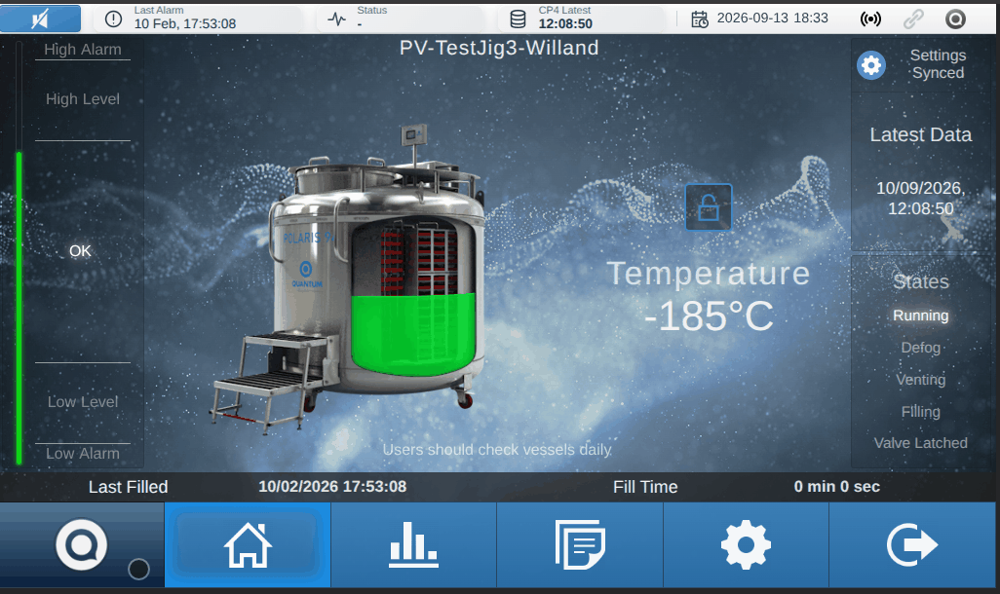
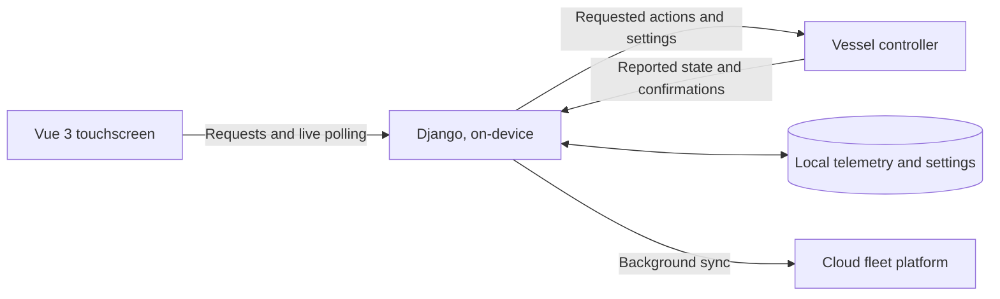
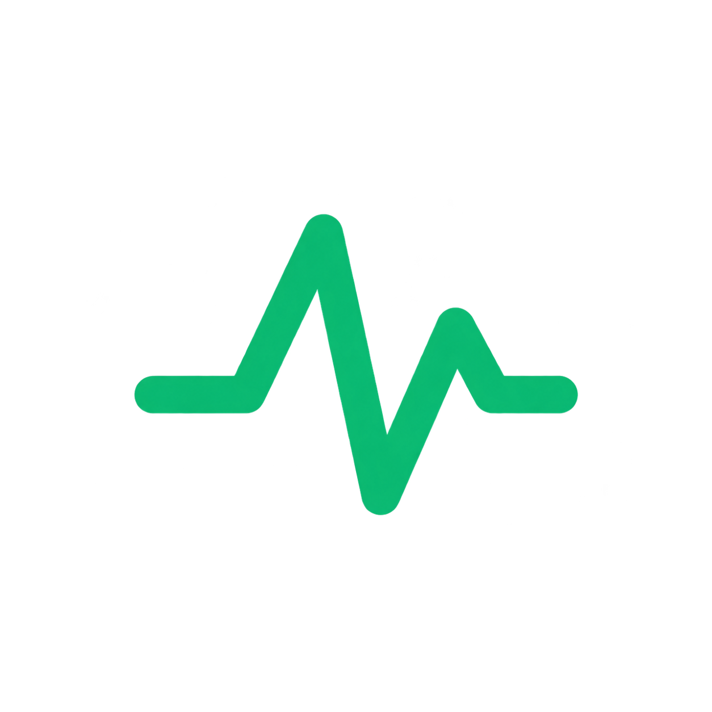
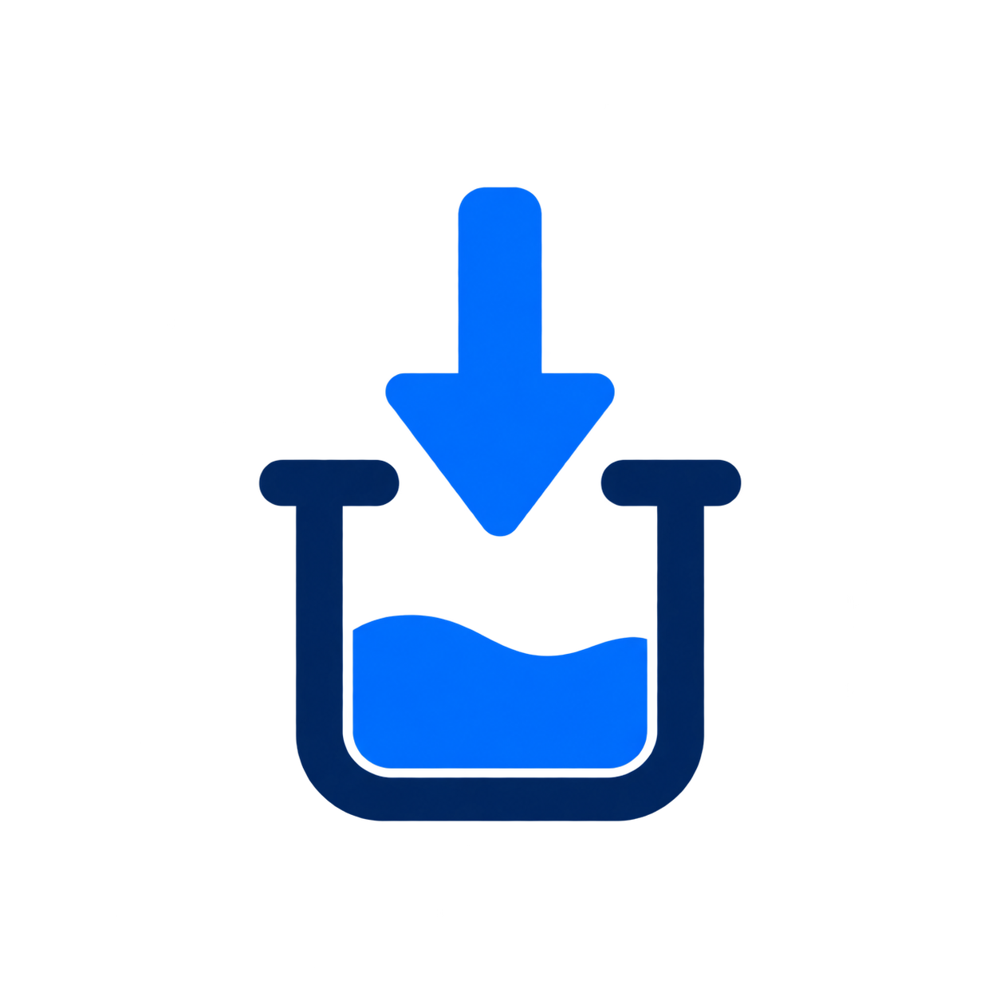
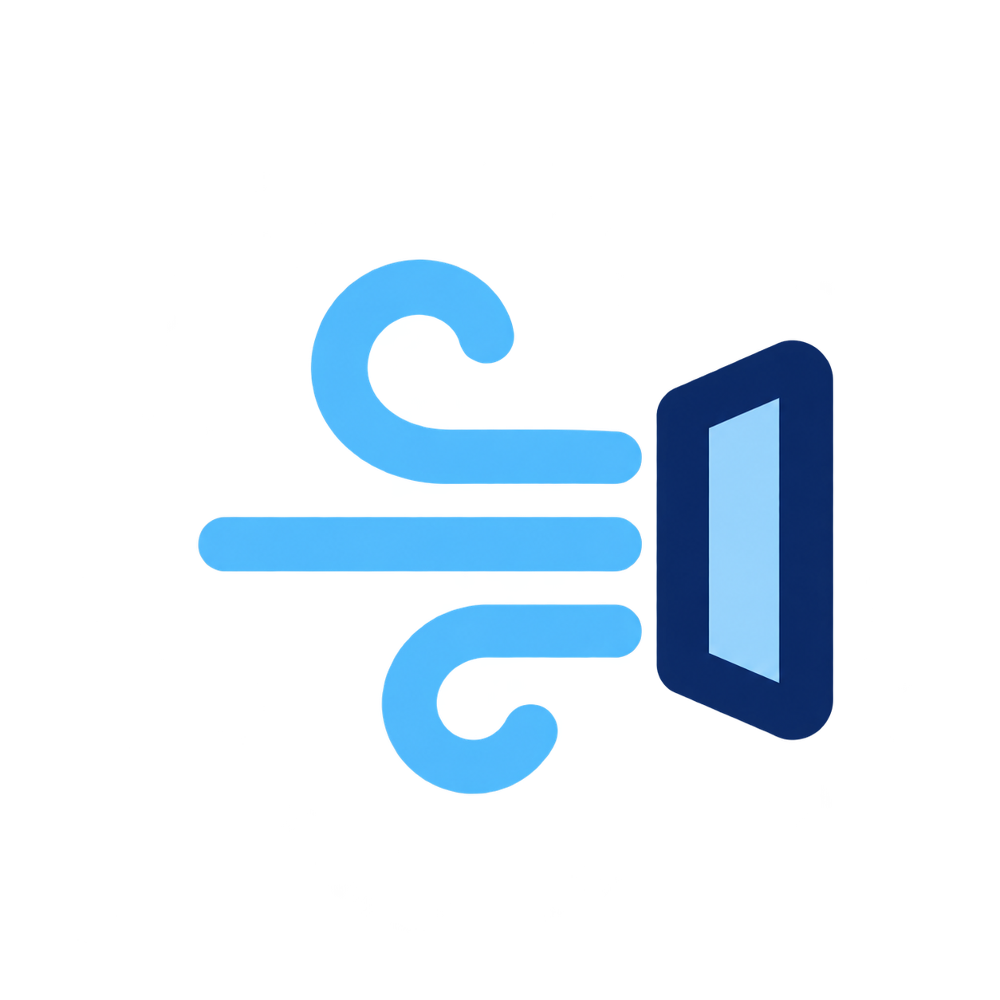
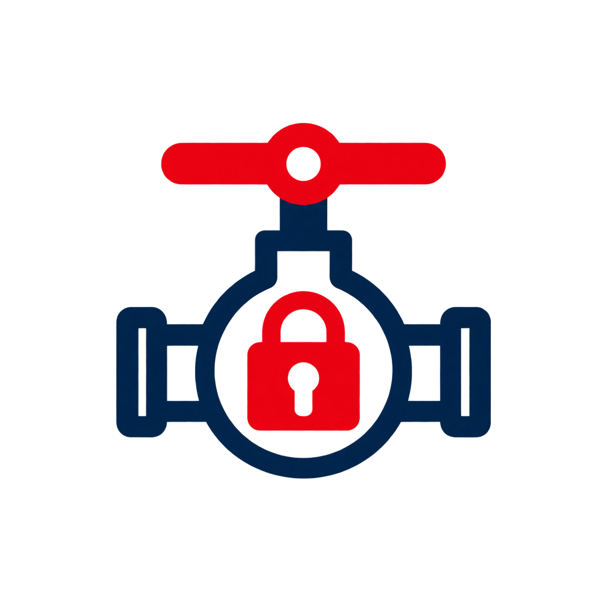
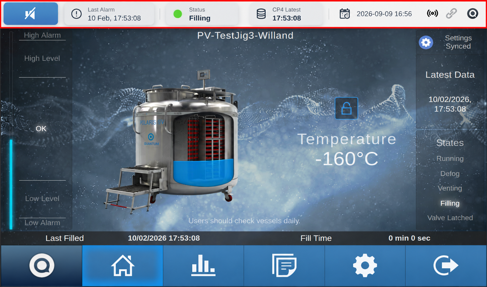
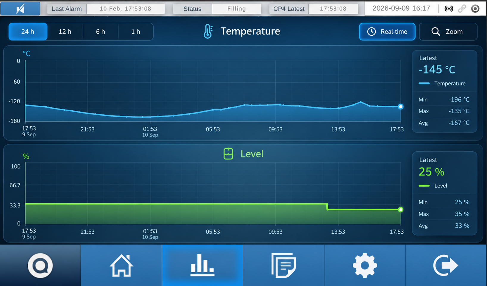
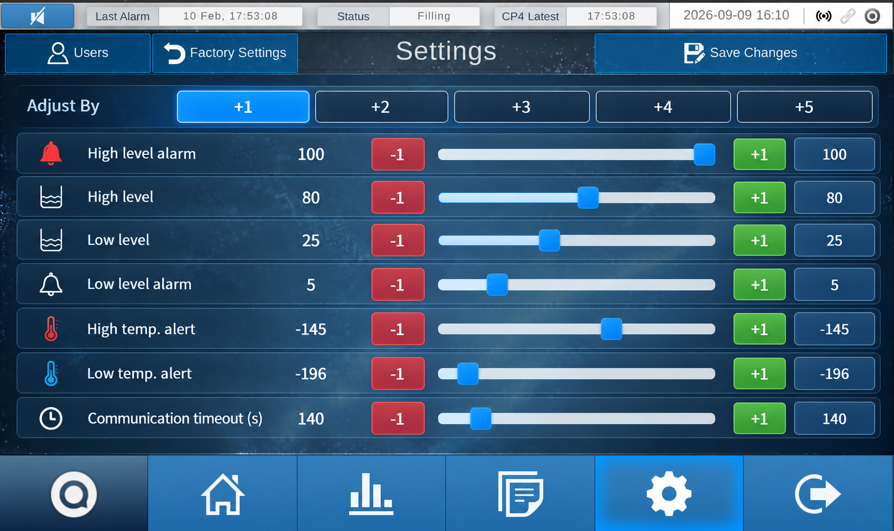
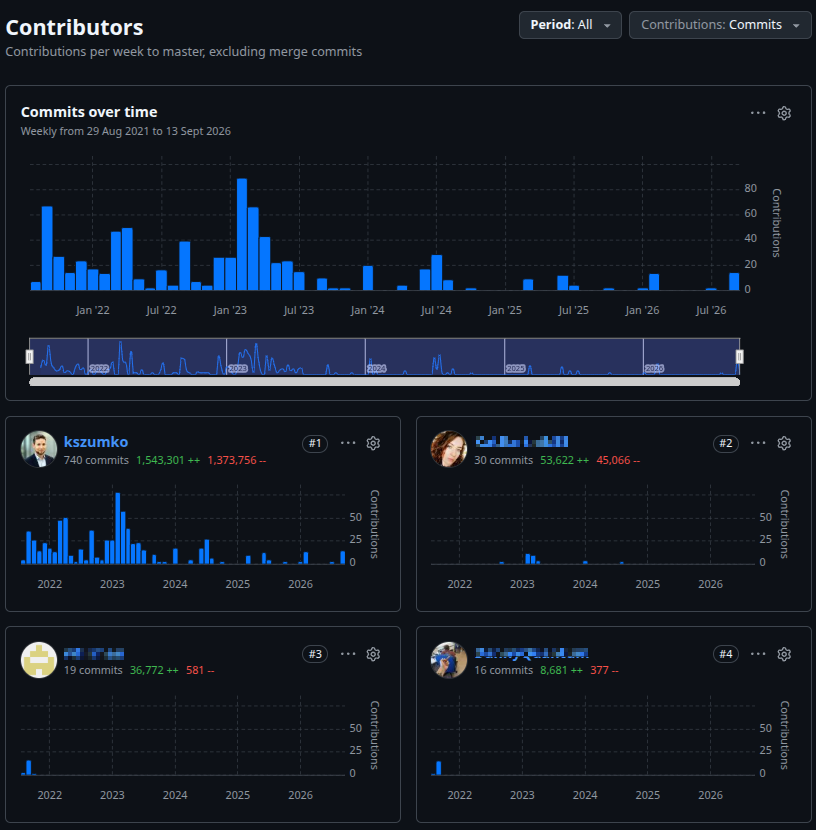

  

<h1 align="center">Polaris Vector</h1>

  <b>A production touchscreen control system I architected and delivered, leading an 8-person cross-functional team
  from concept to production rollout in 8 months — now running unattended on 100+ connected devices, 24/7.</b>

  <a href="#highlights">Highlights</a> ·
  <a href="#the-bets-that-made-this-possible">Key decisions</a> ·
  <a href="#decisions-beyond-the-code">Beyond the code</a> ·
  <a href="#the-problem">The problem</a> ·
  <a href="#the-solution">The solution</a> ·
  <a href="#engineering-highlights">Engineering</a> ·
  <a href="#visuals">Visuals</a>

 

## Highlights

- **Architected a real industrial product from scratch and led an 8-person cross-functional team to production rollout in 8 months** — a touchscreen system that monitors and controls physical cryogenic hardware, now supporting **over 100 connected devices** running unattended in the field.
- **Made and owned the core technology bet** that still shapes the product today: Django + Vue 3 over the "obvious" embedded-Python choices, years before it was the safe option.
- **Picked the hardware platform, too** — moved the fleet from Raspberry Pi to LattePanda for reliability and price/performance, after hitting real problems in the field.
- **Built EU GMP Annex 11 compliance in, not bolted on after** — tamper-evident audit trails, attributable user actions and controlled workflows, down to an on-device Linux user architecture designed for regulated computerised systems from day one.
- **Built multi-tier alarm propagation and escalation logic** covering generation, acknowledgement, muting and feedback states, with full auditability.
- **Made the operational calls too, not just the technical ones** — including how a fleet this size gets supported remotely, day to day.
- **Designed the trust boundary between software and hardware**, so the interface never shows an operator something the physical equipment hasn't actually confirmed.
- **Delivered a zero-downtime migration** of a live cloud integration to a new backend generation, with nothing in the field ever going offline.
- **Owned the architecture across the entire stack** — backend, frontend, background processing, deployment and quality tooling — while leading the team that built it.

 

## The Bets That Made This Possible

### Frontend: Vue 3 over Kivy or PyQt

> Years ago, this touchscreen could have been built in **Kivy** or **PyQt** — the default choices for a Python-based embedded UI. I chose neither.
>
> Kivy struggled to hit smooth, high-frame-rate animations on the target hardware. PyQt's widget styling looked dated — closer to a legacy Windows app than a modern industrial touchscreen. So I made the call to build the interface as a **Vue 3** single-page app, rendered full-screen in a kiosk browser, backed by a **Django** API.
>
> That one decision is why the product looks and feels the way it does today: fluid animations, modern styling that can be redesigned in CSS instead of fought inside a desktop widget toolkit, and a UI that runs comfortably on modest embedded hardware. It's held up for years, across multiple screen sizes and hardware revisions, without needing to be rethought.

**Why it keeps paying off, years later:**

- **Fast to onboard.** Anyone who knows HTML/CSS/JS is already productive — unlike Kivy, Flutter or PyQt, there's no separate UI framework paradigm to learn before someone can contribute.
- **Fast to iterate.** Vue's dev server shows changes live as you type, so the gap between "idea" and "seeing it on screen" is seconds, not a rebuild-and-relaunch cycle.
- **A huge head start on polish.** The web ecosystem means a lot of the visual work doesn't have to be built from nothing — drop-in CSS animations from sites like [animista.net](https://animista.net), large libraries of ready-made SVG icons, and mature JavaScript animation libraries all made it fast to make the UI look genuinely good, not just functional.

### Hardware: LattePanda over Raspberry Pi

> We started, like most embedded projects do, on Raspberry Pi. Two things pushed me off it: SD cards failing in the field — the classic Pi reliability problem — and a steady stream of strange, hard-to-reproduce bugs that only ever showed up running on ARM (RPi 3, RPi 4), even though all development happened on x86.
>
> I moved the fleet to **LattePanda**, an x86 single-board computer. It's simply better hardware for the money — an eMMC drive instead of an SD card, more performance per £ — but the bigger win was predictability: the architecture we develop and test on is the exact architecture running in the field, so whole categories of "works on my machine" bugs stopped happening entirely.

 

## Decisions Beyond the Code

Shipping to the field is more than writing software — it's making sure 100+ devices out there can actually be supported.

- **Remote support, chosen deliberately.** With a fleet this size spread across sites, someone eventually needs to reach a device without a truck roll. I chose **AnyDesk** specifically for its licensing model: a single paid plan comfortably covers a large, growing device fleet, which was a much better fit for Quantum Cryogenics than a per-seat or per-device tool.
- **Compliance designed in at the OS level.** The system needed to be **Annex 11** compatible (EU GMP requirements for computerised systems in regulated environments). Rather than retrofit this, I split each device into separate Linux user accounts by design: the whole Django stack runs under its own dedicated, restricted service account, while the touchscreen kiosk is shown to a separate, read-only account that only ever sees the desktop it boots straight into.

 

## The Problem

A cryogenic vessel doesn't get to be "eventually consistent." It needs a local, always-on view of temperature, liquid level, alarms and state — and every operator action has to reach the physical equipment, not just a database row.

<table width="100%">
  <tr>
    <td width="33%" valign="top" align="center">
      <h3>🔒 Hardware is source of Truth</h3>
      
The physical equipment — not the UI, not the database, not the cloud — is authoritative for vessel state. A request being saved doesn't mean it happened.

    </td>
    <td width="33%" valign="top" align="center">
      <h3>🎨 Feel Modern</h3>
      
Operators live with this screen every day. It needed real animation and a UI that could evolve, not a static industrial panel frozen in 2005.

    </td>
    <td width="33%" valign="top" align="center">
      <h3>📡 Work Well Offline</h3>
      
The vessel keeps venting, filling and alarming whether or not the cloud, the network, or an operator is watching. Sync can lag; safety can't.

    </td>
  </tr>
</table>

 

## The Solution

Polaris Vector runs directly on a Linux single-board computer attached to the vessel, driving a dedicated touchscreen kiosk. Django owns the domain and the API; a background worker owns communication with the equipment; Vue renders what's confirmed, not what's hoped.

1. **Read** — the equipment reports live telemetry and confirms settings changes.
2. **Display** — the on-device backend stores what's reported; the touchscreen reflects it in near real time.
3. **Request** — operator actions are sent to the equipment, but accepted is not the same as applied.
4. **Synchronize** — background jobs keep cloud records up to date, on their own schedule, never blocking what happens on-site.

 

## Engineering Highlights

The interesting problems here weren't "make a web app" — they were the guarantees that have to hold when real, physical equipment is on the other end.

**Hardware-first design.** The system never assumes success. An operator action or a settings change is only treated as real once the equipment itself confirms it — not the moment a request is saved. That single principle runs through the backend, the API and the UI, and it's the reason operators can trust what the screen tells them.

**Safe access to a single physical connection.** The equipment is reachable over one connection at a time. I designed the on-device process architecture so exactly one path can ever touch it, removing an entire class of race conditions by construction rather than by convention.

**Telemetry that scales on modest hardware.** The equipment can report far more often than a small embedded database needs to store. Intelligent throttling keeps the history meaningful and useful without the device's storage or performance degrading over time.

**Cloud sync that never risks the vessel.** Uploading data to our cloud fleet platform is fully decoupled from on-site control. A slow network, a cloud outage, or no internet at all never affects safety or operation where it matters.

**Live migration, zero downtime.** I led the migration of the cloud integration to a new backend generation while the previous one kept serving existing devices — nothing in the field ever went offline during the transition.

 

## Architecture

<table>
<tr><th>Component</th><th>Stack</th><th>Role</th></tr>
<tr>
  <td><b>Backend</b></td>
  <td></td>
  <td>Python, Django and a REST API — domain logic and orchestration.</td>
</tr>
<tr>
  <td><b>Frontend</b></td>
  <td></td>
  <td>Vue 3 single-page app, rendered full-screen as the on-device touchscreen UI.</td>
</tr>
<tr>
  <td><b>Background work</b></td>
  <td></td>
  <td>A dedicated task queue handles equipment communication and cloud sync.</td>
</tr>
<tr>
  <td><b>On-site hardware</b></td>
  <td></td>
  <td>LattePanda x86 single-board computer, driving a dedicated touchscreen kiosk.</td>
</tr>
<tr>
  <td><b>Database</b></td>
  <td></td>
  <td>PostgreSQL in production — settings, telemetry and history.</td>
</tr>
<tr>
  <td><b>Deployment</b></td>
  <td></td>
  <td>Nginx and process supervision, kept running unattended in the field.</td>
</tr>
<tr>
  <td><b>Security &amp; compliance</b></td>
  <td>🔒</td>
  <td>EU GMP Annex 11–compliant design: tamper-evident audit trails and attributable user actions, with the application and the kiosk display running under separate, isolated Linux accounts.</td>
</tr>
</table>

 

## Vessel States at a Glance

<table width="100%">
<tr>
  <td width="25%" align="center">
     
    <b>Running</b> 
    Normal operation
  </td>
  <td width="25%" align="center">
     
    <b>Filling</b> 
    Actively refilling
  </td>
  <td width="25%" align="center">
     
    <b>Venting</b> 
    Pressure relief in progress
  </td>
  <td width="25%" align="center">
     
    <b>Valve Latched</b> 
    Fill valve mechanically locked
  </td>
</tr>
</table>

Every state shown here is reported directly by the equipment itself — never inferred or assumed by the software.

 

## Visuals

<table width="100%">
<tr>
  <th>Dashboard</th>
  <th>Live Charts</th>
  <th>Settings</th>
</tr>
<tr>
  <td></td>
  <td></td>
  <td></td>
</tr>
</table>

 

## Built to Last

- Automated backend and frontend test suites, with coverage tracked over time.
- Consistent code style and linting enforced automatically on every commit.
- Internal architecture documented and kept current — not left to tribal knowledge.

 

  
    Curious how the hardware-trust model, the concurrency design, or the zero-downtime
    migration actually work under the hood? That's exactly what I'd love to walk you through.
  

  

