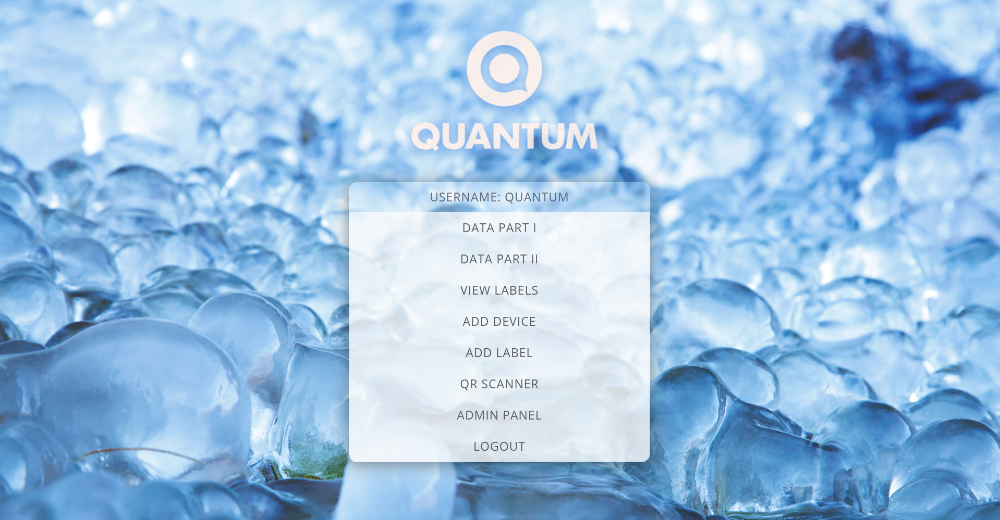
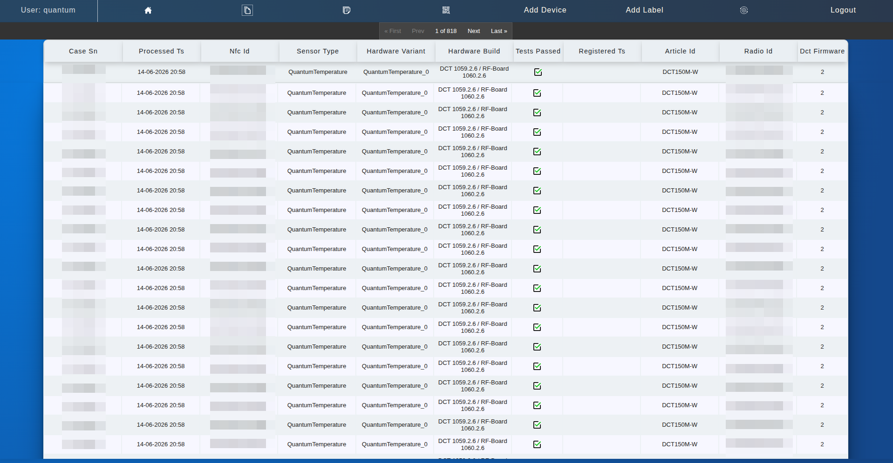
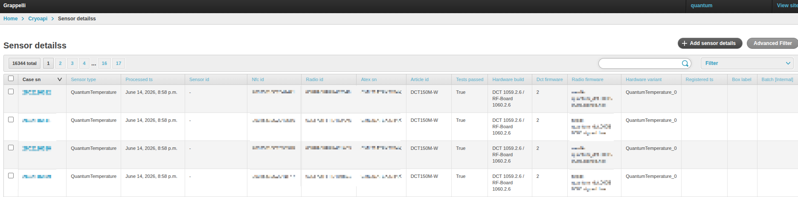
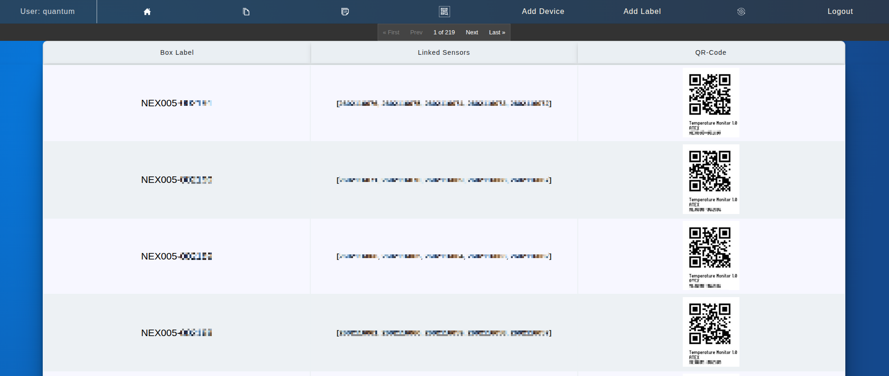
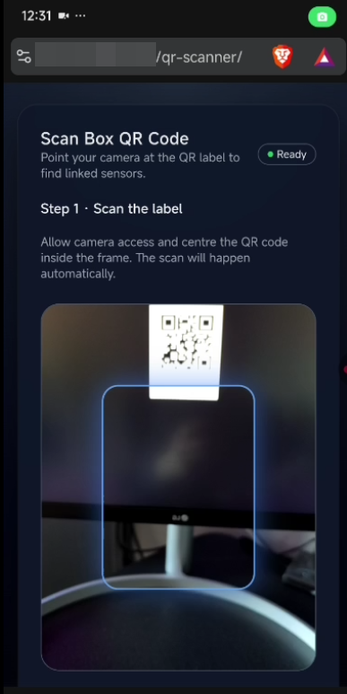
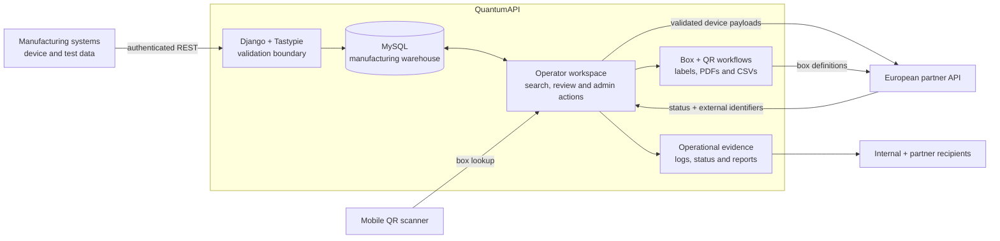
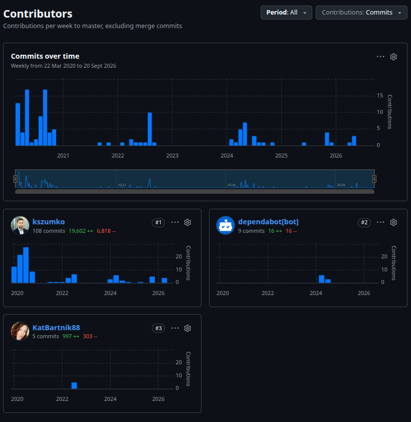

  

<h1 align="center">QuantumAPI</h1>

  <b>Traceable ATEX device management for 10,000+ devices — a manufacturing data warehouse I took over before launch, deployed to production and later refactored as Lead Engineer, keeping device records aligned with a European partner API.</b>

  <a href="#product">Product</a> ·
  <a href="#visuals">Visuals</a> ·
  <a href="#architecture">Architecture</a> ·
  <a href="#engineering">Engineering</a> ·
  <a href="#quality">Quality</a> ·
  <a href="#contributions">Contributions</a>

 

QuantumAPI sits between manufacturing operations and an external logistics platform, providing traceable management for 10,000+ ATEX devices. It receives device records, preserves the manufacturer's source data, gives operators tools to validate and organise it, and synchronises eligible devices and boxes with the partner API.

**My role: Lead Engineer · delivery to production, integration, refactoring and technical leadership**

I took over QuantumAPI from another developer before it had ever been deployed. The MySQL database and core schema were already designed; everything needed to turn that codebase into a working production service was mine — completing the workflows, deploying and operating the application, and coordinating with multiple developers at the European partner company to keep both sides compliant with the shared API contract.

Once it was established in production, I led a refactoring of the application as Lead Engineer, bringing in a junior front-end engineer on their first assignment and guiding their work on the operator interface while I owned the backend, integration and production compatibility.

| 🏭 Centralise production data | ✅ Guard outbound records | 📦 Trace devices to boxes | 🤝 Align two engineering teams |
| :--- | :--- | :--- | :--- |
| Keep identifiers, firmware, test results and manufacturing metadata in one operational record. | Reject or skip incomplete, failed or incorrectly classified devices before partner registration. | Generate labels and connect every shipped box to its constituent sensors. | Turn API requirements into compatible behaviour across organisational boundaries. |

> **What this project demonstrates:** I can pick up someone else's unfinished system, get it into production, keep it running for years, and later lead a team in improving it — while coordinating the people and contracts around it.

 

<h2 align="center">🏭 Product</h2>

QuantumAPI gives manufacturing and logistics staff one authenticated workspace for the life cycle between a completed device record and its registration with an external partner.

| Operational need | QuantumAPI behaviour |
| :--- | :--- |
| **Capture consistent manufacturing records** | An authenticated REST resource accepts sensor identity, firmware, hardware, test and production data into the warehouse. |
| **Find problems before synchronisation** | Validation rejects duplicate case serial numbers, empty values, malformed identifiers and undersized radio IDs. A statistics view surfaces NFC, case and radio duplicates. |
| **Control external registration** | Admin actions check test results and permitted article IDs, skip unsuitable records, submit valid payloads and retain the external response and sensor identifier. |
| **Maintain shipment traceability** | Operators group sensors into boxes, generate QR labels and retain the relationship between each box and its devices. |
| **Support work on the warehouse floor** | A login-protected mobile scanner resolves a box QR code into the box record and its linked sensors. |
| **Keep people informed** | Selection logs, exception logs, status messages and emailed CSV/PDF reports give operators and partner contacts evidence of completed or rejected work. |

The application combines warehouse, integration and operational tooling rather than treating synchronisation as a blind data export. Operators can inspect a record, understand why it was skipped, correct warehouse metadata and trace a physical label back to the source devices.

 

<h2 align="center">🖼️ Visuals</h2>

<table width="100%">
<tr>
  <th>Manufacturing Data</th>
  <th>Warehouse Admin</th>
</tr>
<tr>
  <td></td>
  <td></td>
</tr>
<tr>
  <td>Every manufactured sensor in one searchable record — identity, hardware build, firmware and test result.</td>
  <td>Admin workspace over the full warehouse, with filters and actions for partner registration and box assignment.</td>
</tr>
<tr>
  <th>Box Labels</th>
  <th>Mobile QR Scanner</th>
</tr>
<tr>
  <td></td>
  <td align="center"></td>
</tr>
<tr>
  <td>Each shipped box linked to its sensors, with a generated QR label ready to print.</td>
  <td>Scan a box label on the warehouse floor to pull up the box and the sensors inside it.</td>
</tr>
</table>

 

<h2 align="center">🧱 Architecture</h2>

The system keeps the original MySQL schema as its operational source of truth. Django and Tastypie form the controlled boundary around that data: manufacturing systems write through an authenticated API, staff work through login-protected views and admin actions, and explicit integration functions translate approved records into the external contract.

**Python · Django · Tastypie · MySQL · REST · Pillow · QRCode · HTML/CSS/JavaScript**

 

<h2 align="center">⚙️ Engineering</h2>

<strong>Ownership — from inherited codebase to production service to refactor</strong>

 

**Taking over before launch.** The previous developer had designed the MySQL database and core schema, but the application had never run in production. I learned the existing data model, completed the workflows around it and chose to build on the schema rather than redesign it — shipping to production quickly mattered more to the business than re-litigating decisions that already worked.

**Deploying and operating it.** I deployed QuantumAPI myself and have owned it in production since: server operations, partner-API changes, and new capabilities such as richer box-label output, article-aware QR sheets, batch metadata and mobile QR lookup.

**Refactoring as Lead Engineer.** With years of real manufacturing records depending on the schema, I led a refactoring that improved the application without breaking the data or workflows operators relied on, working with a junior front-end engineer on the operator interface.

| Constraint | Decision | Result |
| :--- | :--- | :--- |
| The schema was designed before I joined, and production data grew on top of it. | Preserve compatible models and extend behaviour around them. | Records created on launch day remain usable today. |
| Some relationships are represented by established string identifiers. | Resolve them consistently through the full box-label value. | Admin lists, web views and mobile lookup agree on which sensors belong to a box. |
| Operators needed improvements more than a platform rewrite. | Refactor and extend incrementally through Django views, templates and admin actions. | Each change addresses a concrete manufacturing or logistics task. |

<strong>Boundary validation — prevent bad warehouse data becoming a partner problem</strong>

 

Inbound validation checks uniqueness and identifier shape before manufacturing records enter the warehouse. Outbound synchronisation applies a second set of business rules: a device that failed testing or carries an unapproved article ID is skipped and logged instead of being registered externally.

This layered approach reflects the different meanings of correctness. A structurally valid warehouse row is not automatically eligible for release, and an operator receives a specific reason when a selected unit cannot move forward.

<strong>Traceability — keep physical labels, local records and remote identifiers connected</strong>

 

Successful device registration stores the returned external sensor identifier and registration state against the local manufacturing record. Box creation sends the selected sensor identifiers to the partner, generates a high-error-correction QR label and updates the selected local records with their box assignment.

Deletion follows the same cross-system concern: the guarded workflow clears local sensor-to-box links, records the action, removes the remote box and then cleans up the generated label asset. Operator-facing reports and audit entries make the outcome visible beyond the HTTP response itself.

<strong>API collaboration — make organisational boundaries part of the engineering work</strong>

 

Compatibility depended on more than producing JSON. I worked directly with multiple developers from the external company's European team to align field meanings, identifiers, response handling and logistics workflows between our systems.

That collaboration turned integration requirements into concrete application rules: mapping local manufacturing fields to the shared payload, retaining partner-issued IDs, separating device registration from NFC reporting, and keeping box definitions consistent on both sides. It is a practical example of communicating across teams while remaining accountable for our implementation.

<strong>Technical leadership — lead the refactor and give a junior engineer a safe first win</strong>

 

During the refactor I brought in a junior front-end engineer for their first assignment. I provided the application context and scoped their work to the Django template layer, so they could improve the operator-facing experience while I kept responsibility for the backend, the integration behaviour and production compatibility.

This balanced delivery with mentoring: the junior engineer shipped a real contribution to a production system, and the refactor moved faster without putting the partner contract or live data at risk.

 

<h2 align="center">🛡️ Quality</h2>

- **Data correctness:** API validation rejects duplicate case serial numbers, empty fields and malformed identifiers; warehouse statistics expose duplicate NFC, case and radio values for operational review.
- **Release safeguards:** external registration excludes failed devices and unapproved article IDs, while box creation limits batch size and only commits the local assignment after an accepted partner response.
- **Traceability:** selection, exception, email, creation and deletion logs connect operational actions to a user or server process; partner responses and external IDs remain visible on the manufacturing record.
- **Access control:** operator pages require a Django login, the ingestion resource uses Basic Authentication with Django authorisation, and privileged workflows live behind the admin interface.
- **Operational usability:** confirmation screens, detailed status messages, emailed reports, searchable admin data and mobile QR lookup help staff understand and recover from workflow problems.
- **Maintenance:** pinned dependencies, documented server operations, repeatable Make targets and automated dependency updates support ongoing ownership of the deployed application.

> [!NOTE]
> The repository contains targeted diagnostic scripts rather than a verified automated test suite, so this showcase deliberately makes no unsupported test-count or coverage claim.

 

<h2 align="center">📈 Contributions</h2>

  QuantumAPI was one of my first projects at Quantum Cryogenics, and I have been its primary contributor ever since — <b>108 commits and ~19.6k lines added</b> since March 2020. The graph shows the story: an intensive first year taking the codebase over and getting it into production, then steady feature work, partner-API changes and the later refactor I led as Lead Engineer.

  

 

  <b>Need someone who can take over an unfinished system, get it into production, and keep moving it forward with users, partner engineers and their own team?</b>

  QuantumAPI is how I approach that work: learn the operational reality, ship, protect the data, make integration failures understandable, and keep delivering improvements that people can use.

  <a href="README.md">← Back to all projects</a>

