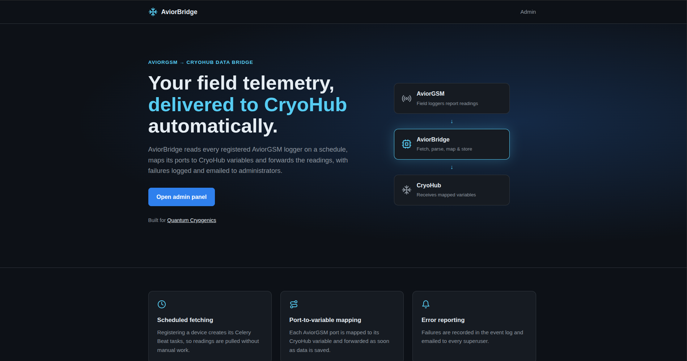

<h1 align="center">Krzysztof Szumko</h1>

<b>Senior Software Engineer</b>

A portfolio of production systems I've designed, built, and shipped — not toy demos.

  <a href="https://github.com/ChrisSzumko">GitHub (Personal)</a> ·
  <a href="https://github.com/kszumko">GitHub (Work)</a> ·
  <a href="https://www.linkedin.com/in/kszumko/">LinkedIn</a> ·
  <a href="mailto:kszumko@gmail.com">Email</a>

 

## Projects

Each project below has its own deep-dive showcase — the problem it solved, the decisions behind it, and how it actually works.

<table align="center" width="680">
<tr><td colspan="2" align="center">

<h3 align="center">🟢 <a href="Polaris-Vector-Showcase.md">Polaris Vector</a></h3>

  

  A production touchscreen control system I designed and built end-to-end — deployed and running unattended across <b>100+ devices</b> in the field, 24/7.

  
  
  

<a href="Polaris-Vector-Showcase.md"><b>Read the full showcase →</b></a>

</td></tr>
<tr><td colspan="2" align="center"> </td></tr>
<tr><td colspan="2" align="center">

<h3 align="center">🟢 <a href="CryoHub-Cloud-Showcase.md">CryoHub Cloud</a></h3>

  

  A multi-tenant cryogenics SaaS platform I architected and own end-to-end — a real-time alarm and escalation pipeline that pages the right person, in the right order, until someone acknowledges the problem.

  
  
  

<a href="CryoHub-Cloud-Showcase.md"><b>Read the full showcase →</b></a>

</td></tr>
<tr><td colspan="2" align="center"> </td></tr>
<tr><td colspan="2" align="center">

<h3 align="center">🟢 <a href="AviorBridge-Showcase.md">AviorBridge</a></h3>

  

  An integration service I built solo that connects AviorGSM loggers to CryoHub — polling each device on its own schedule, translating its data and forwarding fresh readings without manual imports.

  
  
  

<a href="AviorBridge-Showcase.md"><b>Read the full showcase →</b></a>

</td></tr>
<tr><td colspan="2" align="center"><h3>Coming Soon</h3></td></tr>
<tr><th scope="col">Project</th><th scope="col">Status</th></tr>
<tr><td>Quantum API</td><td>🚧 Showcase in progress</td></tr>
<tr><td>Nexus</td><td>🚧 Showcase in progress</td></tr>
<tr><td>Virtual Cryolog</td><td>🚧 Showcase in progress</td></tr>
</table>

 

  More showcases are on their way — check back soon, or reach out above.

