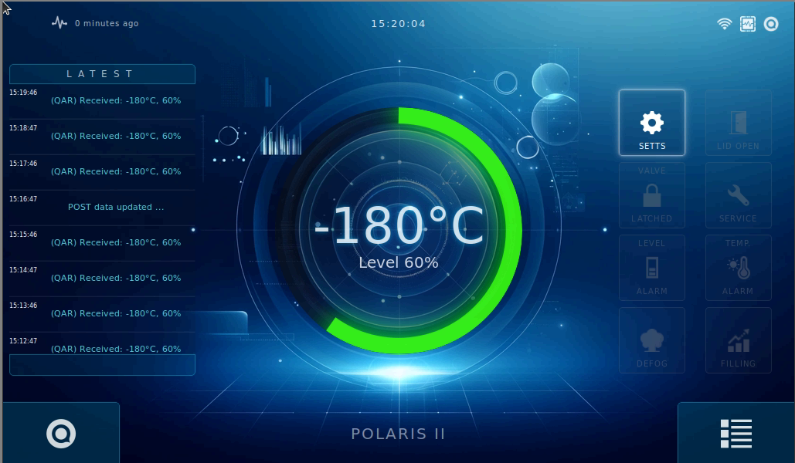
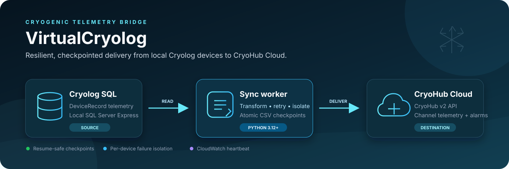
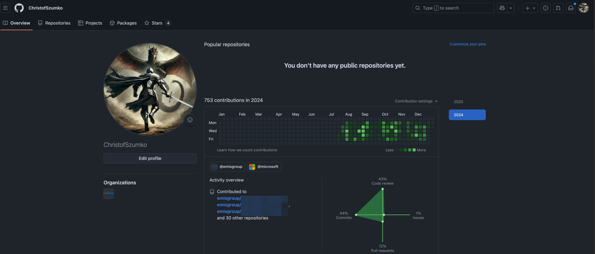
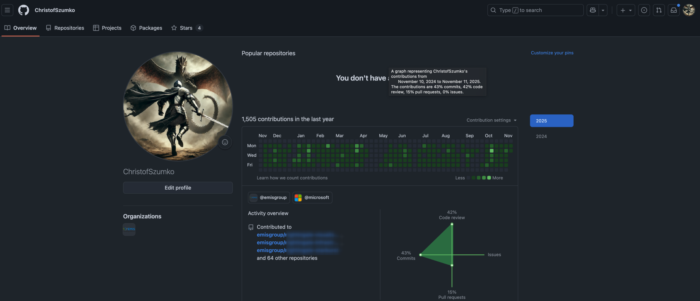

<h1 align="center">Krzysztof Szumko</h1>

<b>Senior Software Engineer — Python / Django / Vue</b>

  8+ years designing and shipping high-stakes production software in healthcare and IoT: multi-tenant SaaS platforms, distributed background systems, industrial touchscreen applications and hardware integrations.

  <b>Python · Django · Vue 3 · PostgreSQL · Celery · AWS · Linux · Rust</b>

  <a href="static/KSzumko-SeniorSoftwareEngineer%28BasicResume%29.pdf"><b>Download CV</b></a> ·
  <a href="https://www.linkedin.com/in/kszumko/">LinkedIn</a> ·
  <a href="https://github.com/ChrisSzumko">GitHub (Personal)</a> ·
  <a href="https://github.com/kszumko">GitHub (Work)</a> ·
  <a href="mailto:kszumko@gmail.com">Email</a>

 

<h2 align="center">What I bring</h2>

- **End-to-end ownership** — architecture, backend, frontend, infrastructure and production support.
- **Production scale** — software running unattended on 100+ connected devices, 24/7; APIs cut from 30s to 300ms; services scaled to 3K requests/second.
- **Backend depth** — multi-tenant Django platforms, Celery/RabbitMQ workflows, EU GMP Annex 11 audit trails and reliability engineering.
- **Technical leadership** — led an 8-person cross-functional team to production in 8 months, managed a 3-person software team, and mentored developers.
- **Operations background** — 10 years in IT support before software engineering, so I design systems that stay supportable once they reach the field.

 

<h2 align="center">Built by someone who used to support it</h2>

Before writing software, I spent a decade on the other side of it: diagnosing failures, talking users through problems and keeping systems running that I didn't build. That shapes every product in this portfolio. I design for the person who has to install it, run it and fix it at 3 a.m.

- **Remote support planned from day one.** Polaris Vector's 100+ field devices are reachable remotely under one licence that covers the whole fleet, so a fault doesn't mean a site visit.
- **Setup that can't be mistyped.** Nexus links to CryoHub with a one-off activation code instead of server addresses and credentials typed on a small screen in a cold room. Tapping an alarm tile explains what it means and who to contact.
- **Failures that explain themselves.** AviorBridge records persistent event logs, runs task health checks and sends Teams and email alerts. QuantumAPI shows operators why a record was skipped, not just that it failed.
- **Recovery without a human.** VirtualCryolog resumes from durable checkpoints after any interruption and ships as a single Windows executable. CloudWatch heartbeats flag silent failures before a customer does.
- **Onboarding in one command.** CryoHub Cloud's `Makefile` takes a fresh checkout to a running environment, so new developers are productive on day one.

 

<table align="center" width="680">
<tr><td colspan="2" align="center">

<h2 align="center">Featured work</h2>

</td></tr>
<tr><td colspan="2" align="center">

<h3 align="center">01 — <a href="CryoHub-Cloud-Showcase.md">CryoHub Cloud</a></h3>

  

  <b>Multi-tenant Django SaaS for cryogenic monitoring and alarm escalation.</b> 
  Architected from greenfield and own V2 end-to-end: tenant isolation, sub-second alerting, and an escalation engine that keeps contacting responders until an alarm is acknowledged. Cut critical API latency 100× (30s → 300ms).

  
  
  

<a href="CryoHub-Cloud-Showcase.md"><b>Architecture & case study →</b></a>

</td></tr>
<tr><td colspan="2" align="center"> </td></tr>
<tr><td colspan="2" align="center">

<h3 align="center">02 — <a href="Polaris-Vector-Showcase.md">Polaris Vector</a></h3>

  

  <b>Industrial touchscreen control platform running unattended on 100+ devices, 24/7.</b> 
  Architected the platform and led an 8-person cross-functional team to production rollout in 8 months — across Django, Vue, Linux and physical hardware, with the hardware, not the UI, always the source of truth.

  
  
  

<a href="Polaris-Vector-Showcase.md"><b>Architecture & case study →</b></a>

</td></tr>
<tr><td colspan="2" align="center"> </td></tr>
<tr><td colspan="2" align="center">

<h3 align="center">03 — <a href="Nexus-Showcase.md">Nexus</a></h3>

  

  <b>Black-box edge gateway that connects on-site cryogenic equipment to CryoHub.</b> 
  A Rust-powered Tauri app on a LattePanda SBC with a 7-inch touchscreen, delivering a 10× memory optimisation on resource-constrained hardware — installed by a field engineer and linked to the cloud with a one-off activation code.

  
  
  

<a href="Nexus-Showcase.md"><b>Architecture & case study →</b></a>

</td></tr>
<tr><td colspan="2" align="center"> </td></tr>
<tr><td colspan="2" align="center">

<h2 align="center">More production systems</h2>

  CryoHub Cloud, Polaris Vector, Nexus, VirtualCryolog and AviorBridge form one <b>CryoHub ecosystem</b> — each is an independently deployed production application, integrated through the CryoHub Cloud API. QuantumAPI is a separate manufacturing and logistics platform.

</td></tr>
<tr><td colspan="2" align="center"> </td></tr>
<tr><td colspan="2" align="center">

<h3 align="center"><a href="VirtualCryolog-Showcase.md">VirtualCryolog</a></h3>

  

  <b>Replay-safe edge worker bringing legacy Cryolog telemetry into CryoHub Cloud.</b> 
  Syncs local SQL Server data without exposing the database, resuming from durable checkpoints after any interruption.

  
  
  

<a href="VirtualCryolog-Showcase.md"><b>Architecture & case study →</b></a>

</td></tr>
<tr><td colspan="2" align="center"> </td></tr>
<tr><td colspan="2" align="center">

<h3 align="center"><a href="AviorBridge-Showcase.md">AviorBridge</a></h3>

  

  <b>Integration service connecting AviorGSM loggers to CryoHub.</b> 
  Polls each device on its own schedule, translates its data and forwards fresh readings without manual imports.

  
  

<a href="AviorBridge-Showcase.md"><b>Architecture & case study →</b></a>

</td></tr>
<tr><td colspan="2" align="center"> </td></tr>
<tr><td colspan="2" align="center">

<h3 align="center"><a href="QuantumAPI-Showcase.md">QuantumAPI</a></h3>

  

  <b>Traceable ATEX device management for 10,000+ devices.</b> 
  Taken over before launch, shipped to production and later refactored as Lead Engineer — syncing device records and QR-labelled boxes with a European partner API.

  
  

<a href="QuantumAPI-Showcase.md"><b>Architecture & case study →</b></a>

</td></tr>
</table>

 

<table align="center" width="680">
<tr><td colspan="2" align="center">

<h2 align="center">Enterprise healthcare data — EMIS / Optum UK</h2>

  <b>Senior Software Engineer → Acting Team Lead · July 2024 – November 2025</b> 
  Backend, data platform and team leadership on the core healthcare data lake that serves time-sensitive clinical queries.

</td></tr>
<tr><td width="50%" valign="top">

<h3 align="center">Data Out Team</h3>

Senior Software Engineer · Jul 2024 – Jan 2025

- Maintained and developed the core data lake platform: Starburst/Trino cluster, auth-routing proxy and Apache Superset, the customer-facing SQL interface.
- **Rebuilt the data lake auth proxy to handle 3K requests/second** (up from 1K) at the same cost, a 3× throughput improvement that cut latency for time-sensitive clinical queries.

  
  

</td><td width="50%" valign="top">

<h3 align="center">Data Management</h3>

Acting Team Lead · Jan 2025 – Nov 2025

- **Led 9 engineers** through sprint planning, quarterly goals and stakeholder demos, improving sprint throughput by ~60%.
- **Cut Airflow cluster costs by 44–66%** by right-sizing to 80th-percentile peak usage, switching environments off out of hours and introducing smarter auto-scaling.
- Led the Airflow v2 upgrade and prototyped the v3 migration.
- Steered the move from Datadog to Dynatrace, consolidating dashboards and alerting on critical platform metrics.

  
  

</td></tr>
<tr><td width="50%" align="center" valign="top">

<b>753 contributions</b> in the second half of 2024

</td><td width="50%" align="center" valign="top">

<b>1,505 contributions</b> Nov 2024 – Nov 2025, with 42% of them code reviews

</td></tr>
</table>

 

<h2 align="center">Let's talk</h2>

  I'm particularly interested in Senior / Lead Python engineering roles involving architecture, complex backend systems and end-to-end product ownership.

  <a href="https://www.linkedin.com/in/kszumko/"><b>LinkedIn</b></a> ·
  <a href="mailto:kszumko@gmail.com"><b>Email</b></a> ·
  <a href="static/KSzumko-SeniorSoftwareEngineer%28BasicResume%29.pdf"><b>Download CV</b></a>

