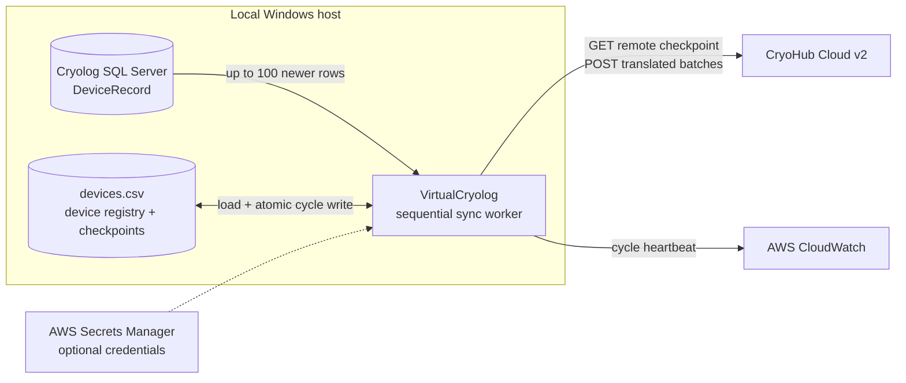

  

<h1 align="center">VirtualCryolog</h1>

  <b>A replay-safe edge worker I built solo that brings legacy cryogenic monitoring data into CryoHub Cloud —
  without exposing the local database.</b>

  <a href="#purpose">Purpose</a> ·
  <a href="#architecture">Architecture</a> ·
  <a href="#engineering">Engineering</a> ·
  <a href="#quality">Quality</a>

 

Cryolog installations record operationally critical temperature, level and alarm data in a local SQL Server database. I built VirtualCryolog to translate that hardware-specific telemetry into CryoHub Cloud v2 payloads, deliver it reliably, and resume from durable checkpoints after interruptions.

**My role: Sole developer · architecture, implementation, testing, packaging and maintenance**

I designed and built the complete worker: its synchronisation lifecycle, device-family translations, local checkpoint store, HTTP and SQL failure handling, AWS integrations, automated tests and single-file Windows distribution.

<table width="100%">
  <tr>
    <td width="25%" valign="top">
      <h3 align="center"> Resume safely</h3>
      
Reconcile local and cloud log IDs before every bounded query.

    </td>
    <td width="25%" valign="top">
      <h3 align="center"> Translate hardware</h3>
      
Convert distinct device records and event flags into consistent cloud channels.

    </td>
    <td width="25%" valign="top">
      <h3 align="center"> Contain failures</h3>
      
Keep one faulty device from blocking the rest of the fleet.

    </td>
    <td width="25%" valign="top">
      <h3 align="center"> Deploy simply</h3>
      
Ship the Python worker as a single Windows executable.

    </td>
  </tr>
</table>

<!--
OPERATIONAL VIEW — successful synchronisation cycle

Capture an anonymised terminal or log view showing several device families completing one cycle, checkpoint persistence and the CloudWatch heartbeat. The image should demonstrate quiet, observable operation rather than expose real device identifiers.
-->

 

<h2 align="center"> Purpose</h2>

VirtualCryolog runs beside a local Cryolog installation. It reads newer `DeviceRecord` rows from Microsoft SQL Server, converts them into CryoHub's channel-oriented data model, posts them over authenticated HTTP and records the latest accepted log ID in `devices.csv`.

The worker supports multiple generations of cryogenic equipment through explicit aliases and event vocabularies, including QAR, MVE, temperature and level gauges, Mowden devices, legacy multi-channel CryoPanel-4 records, and newer independently recorded CP4 probes and valve events.

| Operational need | VirtualCryolog behaviour |
| :--- | :--- |
| **Preserve continuity across restarts** | Starts after the greater of the local CSV checkpoint and CryoHub's latest log ID. |
| **Catch up without unbounded requests** | Reads at most 100 newer records per device and cycle. |
| **Keep mixed hardware understandable** | Maps device-specific readings, channels and terse event flags into stable CryoHub payloads. |
| **Avoid fleet-wide blockage** | Logs ordinary per-device errors and continues with the next configured device. |
| **Retain completed progress** | Writes all in-memory checkpoints once at the end of the cycle, including during an interrupted cycle. |

 

<h2 align="center"> Architecture</h2>

The design is intentionally small and sequential: one process, one shared database connection, one authenticated HTTP session and one local registry. That makes ordering and checkpoint behaviour explicit while keeping deployment practical on existing Windows hosts.

| **Component** | **Technology** | **Description** |
| :--- | :--- | :--- |
| **Runtime** |  | Python 3.12+ worker using `requests` / `urllib3` with pooled, retrying HTTP sessions. |
| **Source data** |  | Cryolog's local SQL Server database, read through `pyodbc`. |
| **Cloud services** |  | Secrets Manager for credentials and CloudWatch for per-cycle heartbeats. |
| **Distribution** |  | PyInstaller one-file executable, run as a Windows service. |

 

<h2 align="center"> Engineering</h2>

<strong>Recovery — reconcile before reading, checkpoint after acceptance</strong>

 

The local CSV is durable state, but it is not treated as the only source of truth. Before querying Cryolog, the worker asks CryoHub for its latest log ID and resumes after the greater local or remote value. This prevents stale local state from replaying an entire history and lets the cloud checkpoint recover progress that was accepted remotely but not yet written locally.

The checkpoint advances only after every prepared channel batch for a device is accepted. A smaller-than-limit batch then triggers cloud alarm evaluation; a full batch defers that check so backlog processing can continue first.

| Challenge | Decision | Result |
| :--- | :--- | :--- |
| Local state can lag the cloud after interruption. | Resume from `max(local_log_id, remote_log_id)`. | Recovery follows the furthest confirmed checkpoint. |
| One Cryolog record can produce several channel posts. | Advance only when all prepared batches succeed. | Partial delivery does not silently skip unsent channels. |
| A replay may meet data already stored remotely. | Treat the API's duplicate-record response as accepted, while rejecting validation errors. | Retried cycles remain safe without masking malformed payloads. |

<strong>Persistence — one explicit commit boundary per cycle</strong>

 

Successful devices update checkpoints in memory. At the end of the cycle, the complete registry is written to a temporary file, flushed and `fsync`ed; the previous primary is copied to `.bak`; and `os.replace` atomically installs the new file. This avoids repeated writes inside the device loop and prevents a partially written CSV from becoming the next startup state.

If the primary file is missing at startup, VirtualCryolog validates the backup's headers and row widths before recovery. A malformed backup is ignored rather than promoted into live state.

<strong>Failure handling — distinguish local faults from shared outages</strong>

 

Device preparation or delivery failures are isolated so later devices still run. HTTP connections are pooled and transient `429` and `5xx` responses use bounded retries with backoff. Checkpoint-write and heartbeat failures are logged without discarding the current process's in-memory progress.

A lost SQL Server connection is different: it affects every remaining device. The connector attempts recovery, then raises a dedicated database-unavailable error. The cycle persists any earlier successes and the process exits non-zero, allowing the Windows service manager to restart it instead of repeatedly failing every configured device.

<strong>Translation — one cloud contract across different hardware generations</strong>

 

Device aliases select focused preparation paths for QAR, MVE, gauges, Mowden and CryoPanel-4 variants. Each path extracts the relevant readings, assigns CryoHub channel identifiers, translates compact Cryolog event flags into readable events and preserves whether an alarm is critical.

The same model handles both legacy CP4 rows containing several channel readings and newer installations where the panel and its probes appear as independent Cryolog device names. That compatibility lives at the translation boundary rather than leaking hardware-specific branches into the cloud API.

<strong>Delivery — package the edge integration as an appliance</strong>

 

Runtime behaviour comes from `config.yaml` and the external `devices.csv` registry. Dependencies are locked with `uv`; Ruff and Make targets standardise local checks; and PyInstaller produces a one-file Windows executable so deployed hosts do not need a separate Python installation.

The worker supports local CryoHub credentials or retrieval through AWS Secrets Manager. It publishes a CloudWatch heartbeat after each completed cycle, giving operations a signal that the whole loop — not merely the process — is still progressing.

 

<h2 align="center"> Quality</h2>

- **Testing:** 105 automated tests pass, with black-box coverage across SQL, HTTP, AWS, configuration and logging boundaries. The tests verify complete synchronisation flows, payload translation, failure isolation, checkpoint recovery and process lifecycle behaviour.
- **Coverage:** the verified `make test-full` run reports **86% statement coverage for `main.py`** and **79% across the measured runtime modules**.
- **Reliability:** bounded queries, local/cloud checkpoint reconciliation, replay-safe delivery, per-device isolation, atomic CSV replacement and validated backup recovery protect data continuity.
- **Security:** the local SQL database remains behind the edge worker; cloud calls use HTTP Basic Auth; credentials may be sourced from AWS Secrets Manager rather than stored in local configuration.
- **Developer experience:** `uv.lock`, Make targets, pytest, Ruff and PyInstaller provide repeatable dependency setup, checking and Windows packaging.

<!--
Evidence capture preparation

VirtualCryolog is a background worker rather than a graphical product. Use anonymised operational evidence with consistent terminal styling; keep timestamps and status messages legible, and never include credentials, customer names or real device identifiers.

| Planned asset | Capture brief |
| :--- | :--- |
| `static/virtual-cryolog/virtualcryolog-cycle-log.png` | A complete successful cycle showing different anonymised device types, checkpoint persistence and the heartbeat result. Approximately 1440 × 900. |
| `static/virtual-cryolog/virtualcryolog-checkpoints.png` | Side-by-side or sequential view of an anonymised `devices.csv` checkpoint before and after accepted uploads, preserving all eight canonical columns. |
| `static/virtual-cryolog/virtualcryolog-service.png` | Windows Services or NSSM view showing VirtualCryolog running with restart behaviour configured; crop unrelated services and machine details. |
-->

 

  
    Curious how the checkpoint reconciliation, the atomic registry write or the CryoPanel-4
    translation actually work under the hood? That's exactly what I'd love to walk you through.
  

  <a href="README.md">← Back to all projects</a>

